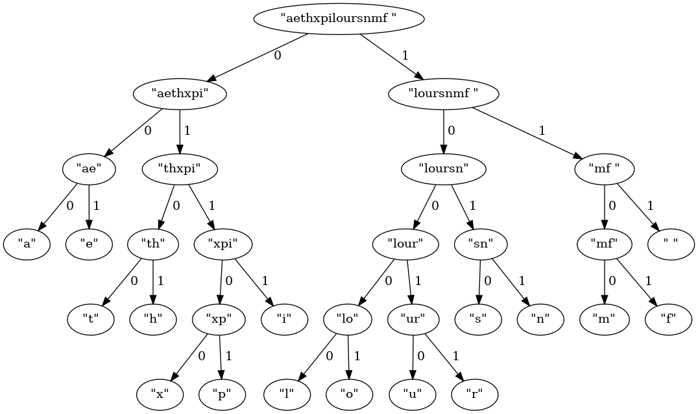

Huffman encoding implementation in ruby

What is currently implemented:
- Compression
- Decompression
- Encoding tree into binary string, so it can be distributed with compressed data
- Reconstructing huffman tree from compressed data
- Statistics on compressed data sizes and savings:
- Graphical representation of generated tree(using GraphViz):
    

